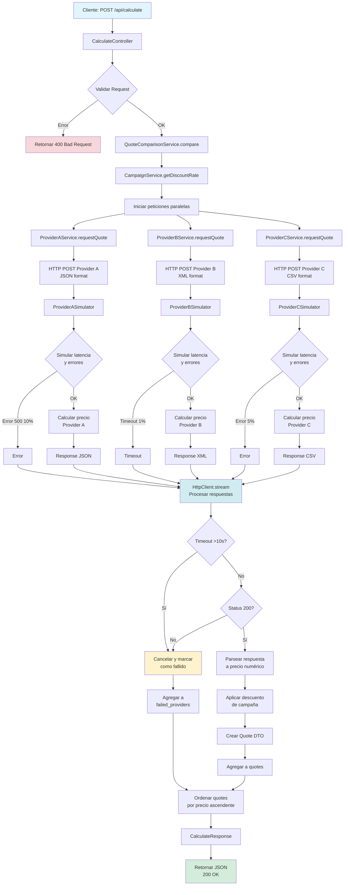

# Coding Challenge Backend

## Resumen de los requisitos

El backend recibe los datos del cliente desde el formulario del frontend, llama a las APIs de los proveedores (simulando aseguradoras externas), agrega y normaliza sus respuestas, aplica el descuento de campaña cuando está activa y devuelve las ofertas ordenadas.

**Requisitos principales:**
- Endpoint principal `POST /calculate` que agrega cotizaciones de todos los proveedores
- APIs mock de proveedores (cada uno con formato distinto: JSON, XML)
- Descuento de campaña del 5% cuando está activa
- Validar input, manejar errores, devolver resultados ordenados
- Tests automatizados: cálculos de precios por proveedor, lógica de comparación/ordenación, descuento de campaña

**Extras de perfil senior (implementados):**
- Peticiones paralelas a los proveedores
- Documentación OpenAPI/Swagger
- Manejo robusto de errores para proveedores no disponibles
- Logging con Monolog
- Tercer proveedor con formato distinto (CSV)
- Configuración Docker sencilla

---

## Enfoque de Implementación

Este fue mi primer proyecto con Symfony. 
Me centré en **buenas prácticas generales de código** más que en herramientas específicas del framework:

- **Principios SOLID** — servicios modulares, responsabilidad única
- **Código legible y testeable** — nombres claros, acoplamiento mínimo
- **Código escalable** — añadir o modificar proveedores o requisitos con cambios mínimos en el flujo existente
- **Manejo explícito de errores** — desacoplado, respuestas consistentes
- **Evitar sobreingeniería**

Seguí la [documentación oficial de Symfony](https://symfony.com/doc) y las [Best Practices](https://symfony.com/doc/current/best_practices.html), y usé el [Symfony Demo](https://github.com/symfony/demo) como referencia de estructura.

---

## Arquitectura

```
src/
├── Controller/
│   ├── CalculateController.php      # Recibe request, valida, delega al servicio
│   └── Provider/
│       ├── ProviderASimulator.php   # API mock JSON (2s, 10% errores)
│       ├── ProviderBSimulator.php   # API mock XML (5s, 1% timeout)
│       └── ProviderCSimulator.php   # API mock CSV (3s, 5% errores)
├── DTO/
│   ├── Request/
│   │   └── QuoteRequest.php         # Validación de input, type safety
│   └── Response/
│       ├── CalculateResponse.php   # Estructura de respuesta agregada
│       └── Quote.php               # Cotización individual con datos de precio
├── Enum/
│   ├── CarType.php                 # turismo, suv, compacto
│   └── CarUse.php                  # private, commercial
├── Service/
│   ├── Campaign/
│   │   └── CampaignService.php      # Activar/desactivar descuento, aplicar 5%
│   ├── Provider/
│   │   ├── ProviderInterface.php   # Contrato para todos los proveedores
│   │   ├── ProviderAService.php    # Cliente HTTP + mapeo JSON
│   │   ├── ProviderBService.php    # Cliente HTTP + mapeo XML
│   │   └── ProviderCService.php    # Cliente HTTP + mapeo CSV
│   └── Quote/
│       └── QuoteComparisonService.php  # Orquesta proveedores, ordena, aplica campaña
├── HttpClient/
│   ├── InternalHttpClient.php      # Optimiza llamadas a localhost (sub-requests internas)
│   └── InternalResponse.php
├── Exception/
│   └── ProviderException.php       # Errores de proveedor estandarizados
└── EventSubscriber/
    └── ExceptionSubscriber.php    # Manejo global de errores API (JSON, logging)
```

### Flujo de Diseño

1. **Controller** — Recibe y valida el input, delega a `QuoteComparisonService`, devuelve JSON.
2. **QuoteComparisonService** — Llama a todos los servicios de proveedores en paralelo vía `HttpClient::stream()`, normaliza respuestas, aplica descuento de campaña, ordena por precio.
3. **Provider Services** — Cada uno implementa `ProviderInterface`: envía la petición en formato del proveedor, parsea la respuesta a nuestros DTOs.
4. **Provider Simulators** — Controladores separados que simulan APIs externas (latencia, errores aleatorios).

Cada proveedor gestiona su propio mapeo (formato request/response).
Los DTOs compartidos garantizan contratos internos consistentes.

### Diagrama de Flujo



---

## Decisiones de Diseño

### Enums (CarType, CarUse)

- **Type safety** y eliminación de strings mágicos, con un ligero aumento de boilerplate a cambio de un modelo de dominio más claro.

### DTOs (QuoteRequest, Quote, CalculateResponse)

- **Validación**, type safety y contratos de API explícitos, con mayor control y rigidez sobre los envíos y recibos. Introduce clases adicionales, pero facilita el mantenimiento y la evolución del sistema.

### Manejo de Errores (ExceptionSubscriber)

- Desacoplado de la lógica de negocio, con un único punto de entrada para respuestas JSON consistentes.  
- Registro con severidad apropiada, en producción se ocultan detalles internos.  
- Enfoque similar a middleware de .NET o manejadores de excepciones en Laravel.

### Campaña: Variable de Entorno

- Solución simple y adecuada para una demo, fácilmente configurable por entorno (dev/prod).
- **Alternativas consideradas:**
  - **Base de datos:** mayor flexibilidad y control en runtime, a costa de añadir dependencia de BD.
  - **Servicio externo:** A/B testing y segmentación avanzada, con coste y dependencia externa.
- **Escalando a producción:** usar base de datos o servicio externo permitiría A/B testing, segmentación geográfica o por usuario y campañas temporales sin necesidad de redespliegues.
Además, estos ajustes podrían ser gestionados por perfiles no técnicos (marketing, ventas, etc.) sin necesidad de tocar código.

### Peticiones Paralelas a Proveedores

- Usa `HttpClient::stream()` de Symfony para peticiones concurrentes.
- Referencia usada: [Boosting performance with Symfony HttpClient and parallel requests](https://dev.to/victorprdh/boosting-performance-with-symfony-httpclient-and-parallel-requests-14g7)
- Timeout de 10 segundos por proveedor, los fallos no bloquean los resultados exitosos.

### Sin Frontend

- Enfoque en calidad del backend y la API.
- OpenAPI/Swagger UI usado para mostrar y probar la API.

---

## Requisitos

- PHP 8.4+
- Composer
- Docker y Docker Compose (opcional)

---

## Inicio Rápido

### Opción 1: Docker (Recomendado)

```bash
cd coding-challenge
docker-compose build
docker-compose up -d

# Accede a la documentación en:
# http://localhost:8080/api/doc
```

### Opción 2: Desarrollo Local

```bash
cd coding-challenge
composer install
composer serve
```

## Endpoints de la API

### Endpoints Principales

| Método | Endpoint | Descripción |
|--------|----------|-------------|
| POST | `/api/calculate` | Compara cotizaciones de todos los proveedores |
| GET | `/api/doc` | Documentación OpenAPI (Swagger UI) |

### Endpoints de Simulación de Proveedores

| Método | Endpoint | Formato | Latencia | % Errores |
|--------|----------|---------|----------|-----------|
| POST | `/api/provider-a/quote` | JSON | ~2s | 10% |
| POST | `/api/provider-b/quote` | XML | ~5s | 1% timeout |
| POST | `/api/provider-c/quote` | CSV | ~3s | 5% |

---

## Ejemplo de Uso

### Request

```bash
curl -X POST http://localhost:8080/api/calculate \
  -H "Content-Type: application/json" \
  -d '{
    "driver_age": 30,
    "car_type": "turismo",
    "car_use": "private"
  }'
```

### Response

```json
{
  "success": true,
  "campaign_active": true,
  "discount_percentage": 5.0,
  "quotes": [
    {
      "provider": "provider-c",
      "provider_name": "Provider C",
      "original_price": 230.00,
      "final_price": 218.50,
      "discount_amount": 11.50,
      "has_discount": true,
      "currency": "EUR"
    },
    {
      "provider": "provider-a",
      "provider_name": "Provider A",
      "original_price": 227.00,
      "final_price": 215.65,
      "discount_amount": 11.35,
      "has_discount": true,
      "currency": "EUR"
    }
  ],
  "cheapest_provider": "provider-a",
  "failed_providers": [],
  "message": null
}
```

---

## Configuración

### Variables de Entorno

| Variable | Por defecto | Descripción |
|----------|-------------|-------------|
| `CAMPAIGN_ACTIVE` | `true` | Activar/desactivar descuento de campaña del 5% |
| `CAMPAIGN_DISCOUNT_RATE` | `0.05` | Tasa de descuento cuando la campaña está activa (0.05 = 5%) |
| `ENABLE_PROVIDER_ERRORS` | `true` | Activar latencia y errores aleatorios en simuladores |
| `APP_INTERNAL_BASE_URL` | `http://localhost:8080` | URL base para sub-requests internas |
| `PROVIDER_A_URL` | `http://localhost:8080/api/provider-a/quote` | Endpoint proveedor A |
| `PROVIDER_B_URL` | `http://localhost:8080/api/provider-b/quote` | Endpoint proveedor B |
| `PROVIDER_C_URL` | `http://localhost:8080/api/provider-c/quote` | Endpoint proveedor C |
| `PROVIDER_TIMEOUT` | `10` | Timeout de peticiones HTTP en segundos |

---

## Tests

# Ejecutar todos los tests
docker compose exec app ./vendor/bin/phpunit

**Cobertura de tests:**
- **Cálculos de precios por proveedor** — `ProviderPriceCalculationTest`
- **Lógica de comparación y ordenación** — `QuoteComparisonServiceTest`
- **Aplicación de descuento de campaña** — `CampaignServiceTest`
- **Endpoint Calculate** — `CalculateEndpointTest`

---

## Mejoras Futuras
- **Clean/Hexagonal**: Separa el dominio de la infraestructura, facilitando tests, cambios de proveedores y evolución independiente de la lógica.
- **Caché:** Redis para respuestas de proveedores
- **Rate limiting:** Protección frente a abuso y consumo excesivo de la API.
- **Base de datos:** Persistir cotizaciones para análisis
- **Monitoreo y observabilidad:** Integrar soluciones como Sentry o herramientas de logging estructurado para capturar errores, métricas y trazas.

---

## Autor
Wei Zheng