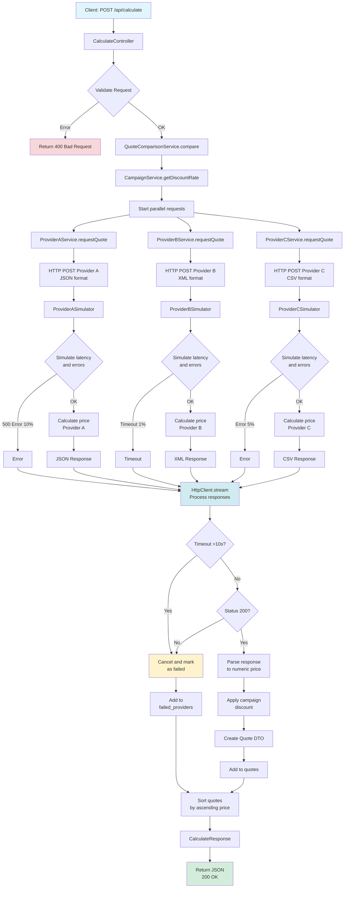

# Coding Challenge Backend

## Requirements Summary

The backend receives customer data from the frontend form, calls provider APIs (simulating external insurers), aggregates and normalizes their responses, applies the campaign discount when active, and returns sorted offers.

**Main requirements:**
- Main endpoint `POST /calculate` that aggregates quotes from all providers
- Mock provider APIs (each with a different format: JSON, XML)
- 5% campaign discount when active
- Validate input, handle errors, return sorted results
- Automated tests: provider price calculations, comparison/sorting logic, campaign discount

**Senior-level extras (implemented):**
- Parallel requests to providers
- OpenAPI/Swagger documentation
- Robust error handling for unavailable providers
- Logging with Monolog
- Third provider with a different format (CSV)
- Simple Docker setup

---

## Implementation Approach

This was my first Symfony project.
I focused on **general code best practices** rather than framework-specific tooling:

- **SOLID principles** - modular services, single responsibility
- **Readable and testable code** - clear naming, minimal coupling
- **Scalable code** - add or modify providers/requirements with minimal changes to the existing flow
- **Explicit error handling** - decoupled, consistent responses
- **Avoid overengineering**

I followed the [official Symfony documentation](https://symfony.com/doc) and [Best Practices](https://symfony.com/doc/current/best_practices.html), and used [Symfony Demo](https://github.com/symfony/demo) as a structure reference.

---

## Architecture

```
src/
├── Controller/
│   ├── CalculateController.php      # Receives request, validates, delegates to service
│   └── Provider/
│       ├── ProviderASimulator.php   # JSON mock API (2s, 10% errors)
│       ├── ProviderBSimulator.php   # XML mock API (5s, 1% timeout)
│       └── ProviderCSimulator.php   # CSV mock API (3s, 5% errors)
├── DTO/
│   ├── Request/
│   │   └── QuoteRequest.php         # Input validation, type safety
│   └── Response/
│       ├── CalculateResponse.php    # Aggregated response structure
│       └── Quote.php                # Individual quote with pricing data
├── Enum/
│   ├── CarType.php                  # turismo, suv, compacto
│   └── CarUse.php                   # private, commercial
├── Service/
│   ├── Campaign/
│   │   └── CampaignService.php      # Enable/disable discount, apply 5%
│   ├── Provider/
│   │   ├── ProviderInterface.php    # Contract for all providers
│   │   ├── ProviderAService.php     # HTTP client + JSON mapping
│   │   ├── ProviderBService.php     # HTTP client + XML mapping
│   │   └── ProviderCService.php     # HTTP client + CSV mapping
│   └── Quote/
│       └── QuoteComparisonService.php  # Orchestrates providers, sorts, applies campaign
├── HttpClient/
│   ├── InternalHttpClient.php       # Optimizes localhost calls (internal sub-requests)
│   └── InternalResponse.php
├── Exception/
│   └── ProviderException.php        # Standardized provider errors
└── EventSubscriber/
    └── ExceptionSubscriber.php      # Global API error handling (JSON, logging)
```

### Design Flow

1. **Controller** - Receives and validates input, delegates to `QuoteComparisonService`, returns JSON.
2. **QuoteComparisonService** - Calls all provider services in parallel via `HttpClient::stream()`, normalizes responses, applies campaign discount, sorts by price.
3. **Provider Services** - Each implements `ProviderInterface`: sends request in provider-specific format, parses response into internal DTOs.
4. **Provider Simulators** - Separate controllers that simulate external APIs (latency, random errors).

Each provider handles its own request/response mapping.
Shared DTOs ensure consistent internal contracts.

### Flow Diagram



---

## Design Decisions

### Enums (CarType, CarUse)

- **Type safety** and removal of magic strings, with a slight increase in boilerplate in exchange for a clearer domain model.

### DTOs (QuoteRequest, Quote, CalculateResponse)

- **Validation**, type safety, and explicit API contracts for stronger control over inputs and outputs. It adds classes, but improves maintainability and system evolution.

### Error Handling (ExceptionSubscriber)

- Decoupled from business logic, with a single entry point for consistent JSON responses.
- Logs with appropriate severity; internal details are hidden in production.
- Similar approach to .NET middleware or Laravel exception handlers.

### Campaign: Environment Variable

- A simple and suitable solution for a demo, easily configurable per environment (dev/prod).
- **Alternatives considered:**
  - **Database:** more flexibility and runtime control, at the cost of adding a DB dependency.
  - **External service:** A/B testing and advanced segmentation, with extra cost and external dependency.
- **Scaling to production:** using a database or external service would enable A/B testing, geographic/user segmentation, and temporary campaigns without redeployments.
  Additionally, these settings could be managed by non-technical profiles (marketing, sales, etc.) without changing code.

### Parallel Provider Requests

- Uses Symfony `HttpClient::stream()` for concurrent requests.
- Reference used: [Boosting performance with Symfony HttpClient and parallel requests](https://dev.to/victorprdh/boosting-performance-with-symfony-httpclient-and-parallel-requests-14g7)
- 10-second timeout per provider; failures do not block successful results.

### No Frontend

- Focus on backend and API quality.
- OpenAPI/Swagger UI used to display and test the API.

---

## Requirements

- PHP 8.4+
- Composer
- Docker and Docker Compose (optional)

---

## Quick Start

### Option 1: Docker (Recommended)

```bash
cd coding-challenge
docker-compose build
docker-compose up -d

# Access the documentation at:
# http://localhost:8080/api/doc
```

### Option 2: Local Development

```bash
cd coding-challenge
composer install
composer serve
```

## API Endpoints

### Main Endpoints

| Method | Endpoint | Description |
|--------|----------|-------------|
| POST | `/api/calculate` | Compares quotes from all providers |
| GET | `/api/doc` | OpenAPI documentation (Swagger UI) |

### Provider Simulation Endpoints

| Method | Endpoint | Format | Latency | Error % |
|--------|----------|--------|---------|---------|
| POST | `/api/provider-a/quote` | JSON | ~2s | 10% |
| POST | `/api/provider-b/quote` | XML | ~5s | 1% timeout |
| POST | `/api/provider-c/quote` | CSV | ~3s | 5% |

---

## Usage Example

### Request

```bash
curl -X POST http://localhost:8080/api/calculate \
  -H "Content-Type: application/json" \
  -d '{
    "driver_age": 30,
    "car_type": "turismo",
    "car_use": "private"
  }'
```

### Response

```json
{
  "success": true,
  "campaign_active": true,
  "discount_percentage": 5.0,
  "quotes": [
    {
      "provider": "provider-c",
      "provider_name": "Provider C",
      "original_price": 230.00,
      "final_price": 218.50,
      "discount_amount": 11.50,
      "has_discount": true,
      "currency": "EUR"
    },
    {
      "provider": "provider-a",
      "provider_name": "Provider A",
      "original_price": 227.00,
      "final_price": 215.65,
      "discount_amount": 11.35,
      "has_discount": true,
      "currency": "EUR"
    }
  ],
  "cheapest_provider": "provider-a",
  "failed_providers": [],
  "message": null
}
```

---

## Configuration

### Environment Variables

| Variable | Default | Description |
|----------|---------|-------------|
| `CAMPAIGN_ACTIVE` | `true` | Enable/disable 5% campaign discount |
| `CAMPAIGN_DISCOUNT_RATE` | `0.05` | Discount rate when campaign is active (0.05 = 5%) |
| `ENABLE_PROVIDER_ERRORS` | `true` | Enable latency and random errors in simulators |
| `APP_INTERNAL_BASE_URL` | `http://localhost:8080` | Base URL for internal sub-requests |
| `PROVIDER_A_URL` | `http://localhost:8080/api/provider-a/quote` | Provider A endpoint |
| `PROVIDER_B_URL` | `http://localhost:8080/api/provider-b/quote` | Provider B endpoint |
| `PROVIDER_C_URL` | `http://localhost:8080/api/provider-c/quote` | Provider C endpoint |
| `PROVIDER_TIMEOUT` | `10` | HTTP request timeout in seconds |

---

## Tests

# Run all tests
docker compose exec app ./vendor/bin/phpunit

**Test coverage:**
- **Provider price calculations** - `ProviderPriceCalculationTest`
- **Comparison and sorting logic** - `QuoteComparisonServiceTest`
- **Campaign discount application** - `CampaignServiceTest`
- **Calculate endpoint** - `CalculateEndpointTest`

---

## Future Improvements
- **Clean/Hexagonal:** Separate domain from infrastructure to simplify testing, provider changes, and independent evolution of business logic.
- **Split DTOs:** Smaller and more specific entities, or grouping by functional context as requirements and complexity grow.
- **Cache:** Redis for provider responses.
- **Rate limiting:** Protection against API abuse and excessive usage.
- **Database:** Persist quotes for analytics.
- **Monitoring and observability:** Integrate solutions such as Sentry or structured logging tools to capture errors, metrics, and traces.

---

## Author
Wei Zheng